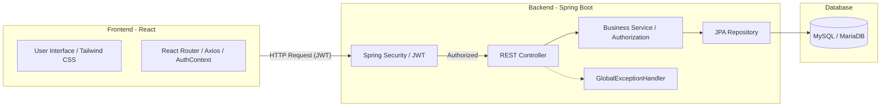

# UniNote System Architecture & Data Flow

이 문서는 UniNote 프로젝트의 전체적인 시스템 아키텍처와 데이터 흐름을 정의합니다.

---

## 1. 전체 시스템 아키텍처 (System Overview)

UniNote는 클라이언트-서버 모델을 따르는 **Full-Stack 웹 애플리케이션**입니다.

---

## 2. 레이어별 상세 구조 (Layered Architecture)

### 2.1. Frontend (React)
- **View Layer (`src/pages`)**: `AppLayout`을 도입하여 사이드바 및 헤더를 중앙화함.
- **API Layer (`src/api`)**: `axios` 인터셉터를 통해 401(인증), 403(인가) 에러를 중앙 처리함.
- **State/Security (`src/context`, `src/routes`)**: `AuthContext`로 전역 인증 관리 및 `ProtectedRoute`를 통한 접근 제어 추상화.

### 2.2. Backend (Spring Boot)
- **Presentation Layer (`controller`)**: 클라이언트 요청 수신 및 비즈니스 예외 중앙 처리.
- **Business Layer (`service`)**: 비즈니스 로직과 함께 **인가(Authorization) 검증** 수행(`validateEnrollment`).
- **Security Layer (`security`)**: JWT 유효성 검사.
- **Exception Layer (`exception`)**: `GlobalExceptionHandler`를 통해 표준화된 `ErrorResponse` 응답 제공.

---

## 3. 핵심 데이터 흐름 (Core Data Flow)

### 3.1. 인증 및 보안 흐름 (Authentication & Authorization Flow)
1. **인증(Auth)**: JWT를 통해 사용자를 식별.
2. **인가(Authz)**: 서비스 계층에서 접근 리소스가 사용자 소유인지(수강 중인 강의인지) 검증.
3. **중앙화된 예외 처리**: 검증 실패 시 `CourseAccessException` 등을 발생시켜 일관된 JSON 에러 응답.

---

## 4. 데이터베이스 엔티티 관계 (ERD Concept)

- **Student / Professor**: 회원 정보 및 권한.
- **Course**: 강의 정보 (강좌명, 교수, 시간표).
- **Enrollment**: 수강 신청 정보 (Student <-> Course 다대다 연결).
- **Note**: 강의별 개인 필기 데이터 (Course-Student 복합 관계).
- **Post**: 강의별 익명 게시글 데이터 (Course 소속).

---
*마지막 업데이트: 2026-04-10 (Gemini CLI)*
